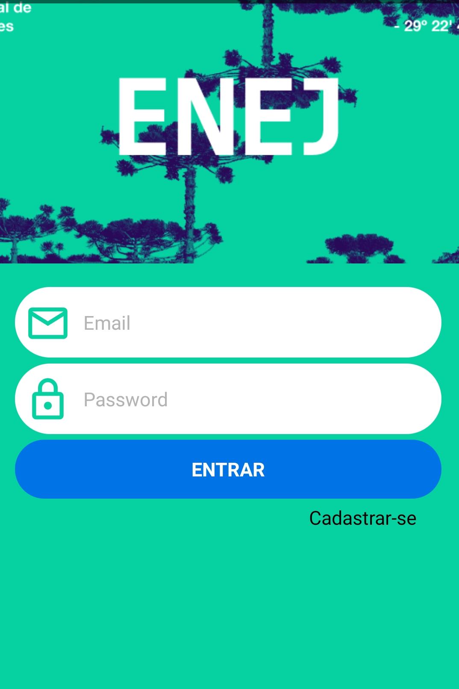
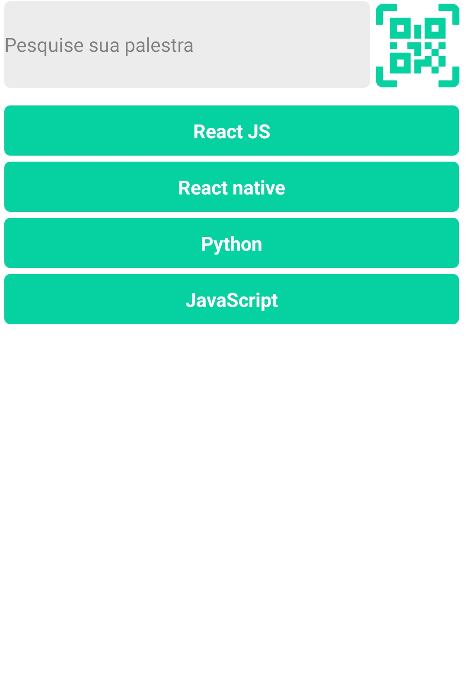
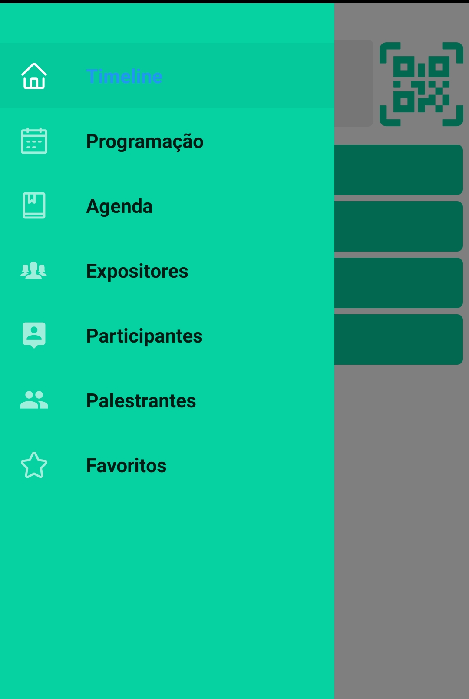
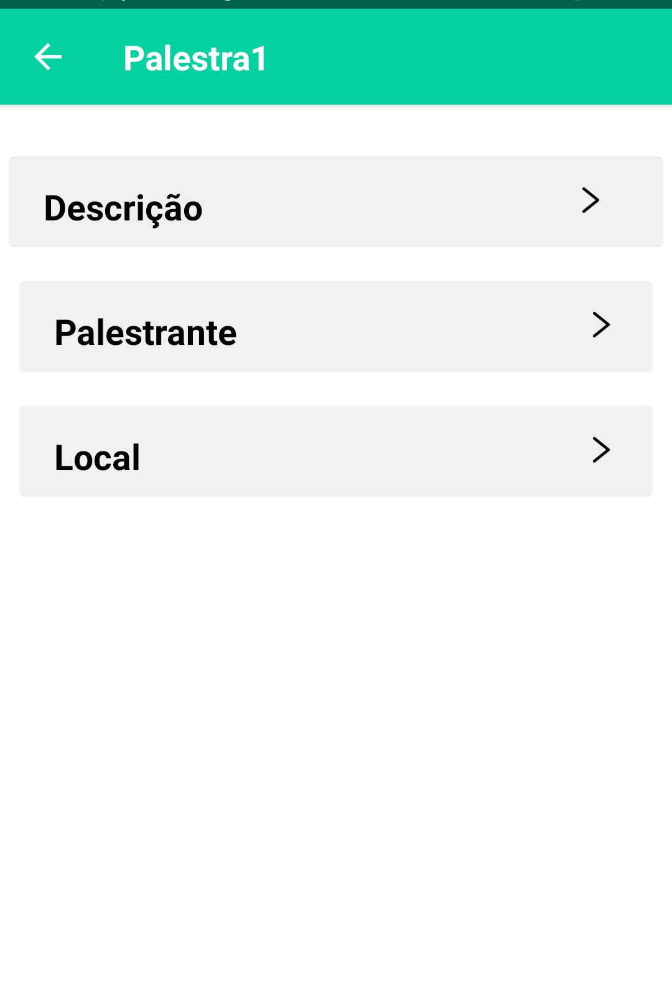
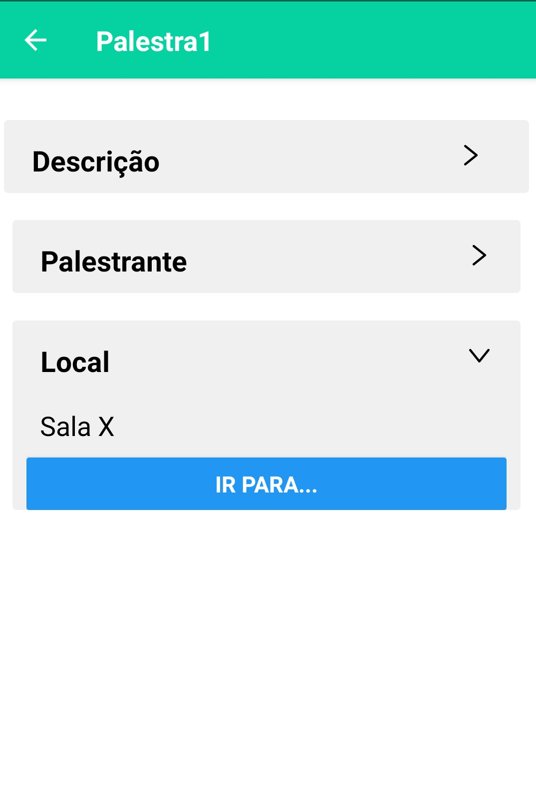

##Estudo de React Native.

Este projeto teve como finalidade o aprendizado de React Native, onde o mesmo serviria como teste para a entrada em uma empresa júnior na data de 25/09/2019.

## ScreenShots do app

    

