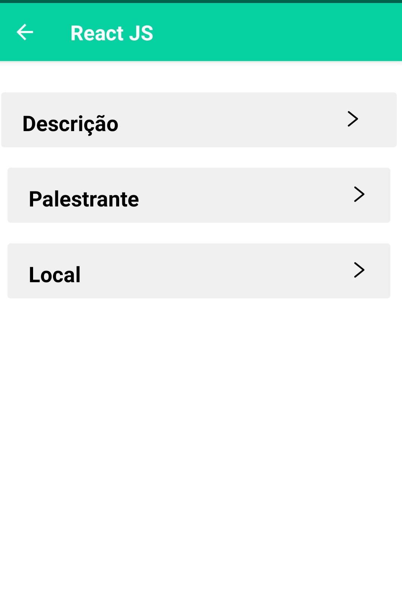

## Estudo de React Native.

Este projeto teve como finalidade o aprendizado de React Native, onde o mesmo serviria como teste para a entrada em uma empresa júnior na data de 25/09/2019.

## ScreenShots do app

#### Tela de login

#### Tela de Timeline
Estariam dispostas as palestras que ocorreriam no evento

 

#### Menu de funcionalidades
 

#### Tela de informações sobre a palestra
 

#### Componente expandido que mostra o dado

Foi muito importante o desenvolvimento desse app, pois apesar de simples e com muitas possíveis melhorias ele me deu uma base para iniciar os estudos que continuam até hoje.

